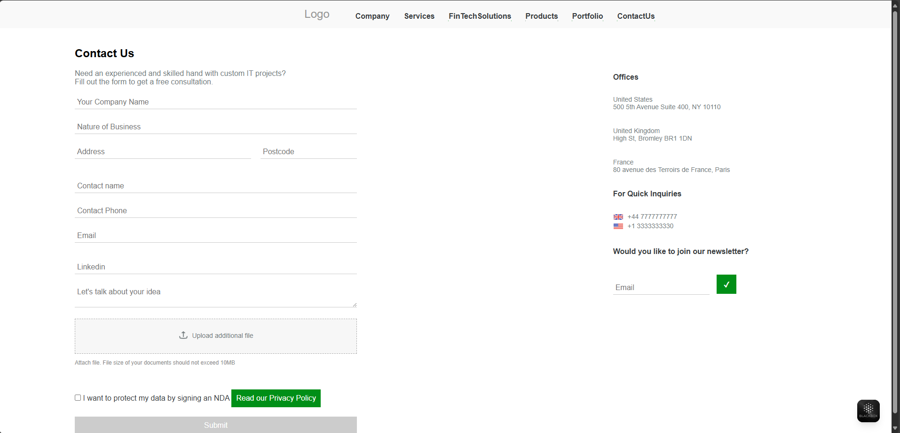
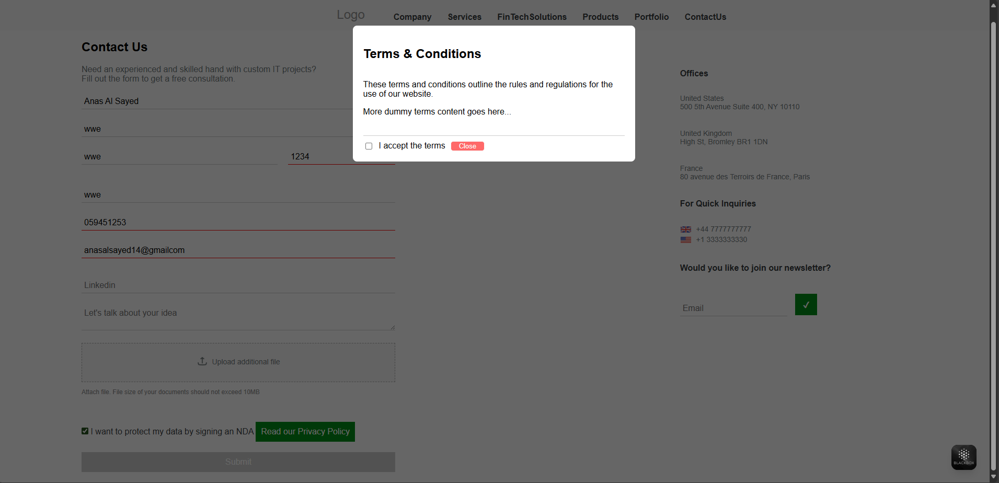
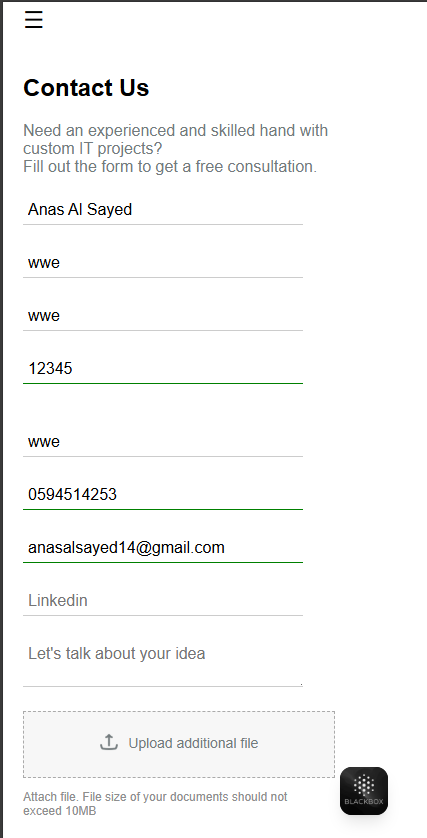
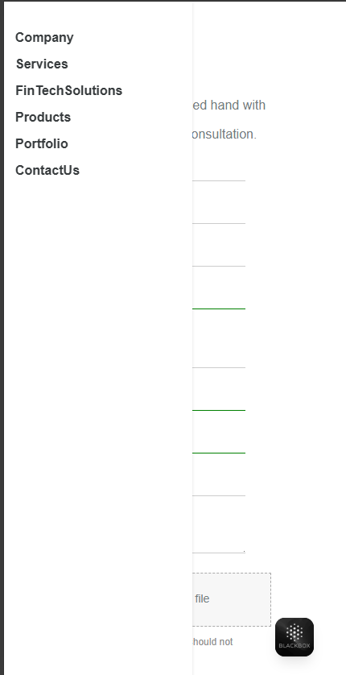
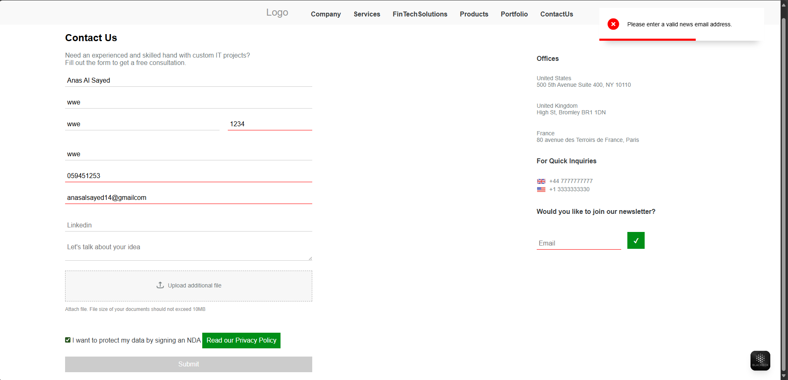
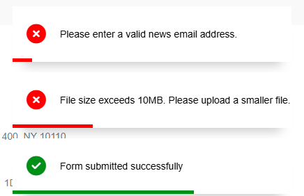
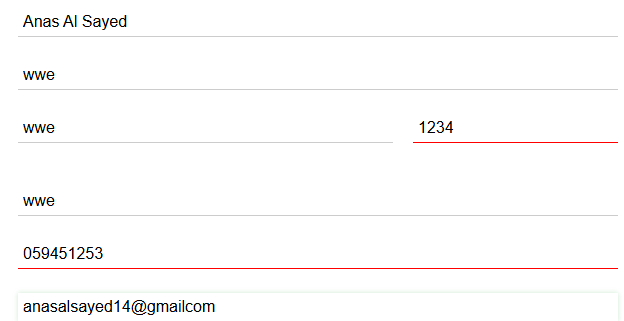

# 📬 Contact Form UI — QuizPlus Task 

Welcome to the official repository for **QuizPlus Task ** — an elegant, responsive, and fully functional **Contact Us Page** created using **HTML, CSS, and JavaScript (no libraries)**.

🔗 [GitHub Repo](https://github.com/AnasAlSayed18/quizplus-task-1)

---

## 🚀 Project Overview

This project is a modern, user-friendly contact page designed with interactive form behavior, client-side validation, toast-style feedback messages, and accessibility in mind. It simulates a real-world contact/consultation form used by software companies or digital agencies.

---

## 🎯 Features

- ✅ Real-time input validation for all fields (email, phone, postcode, etc.)
- 🔐 Terms & Conditions modal with scrollable content and mandatory agreement
- 📎 Secure file upload (PDF only, max 10MB) with validation
- 🔔 Elegant toast-style messages for form feedback (success, error, info)
- 🔒 Form cannot be submitted unless all conditions and validations pass
- 📰 Newsletter subscription with separate email validation
- 📱 Responsive layout with scroll behavior and modern visual styling
- 🍔 Side drawer menu for site navigation, toggleable with outside click close
- 🎨 Smooth UX transitions and consistent design language

---

## 📷 Live Screenshots

All images are stored in the `/img/` directory.

| Home Page                | Terms & Conditions Modal     |
|--------------------------|------------------------------|
|         |             |

| Mobile Responsive View   | Side Drawer Navigation       |
|--------------------------|------------------------------|
|         |             |

| Toast Notification (Error) | Toast Notification (Success) |
|------------------------------|-----------------------------|
|             |            |

| Form Validation             |                            |
|-----------------------------|----------------------------|
|            |                            |


---

## 🛠️ Tech Stack

- **HTML5** — semantic structure
- **CSS3** — Flexbox, scrollable modals, custom buttons, responsive design
- **Vanilla JavaScript** — form validation, modal control, toasts, file checks

---

## 📂 Project Structure

```
quizplus-task-1/
│
├── index.html
├── styles.css
├── img
├── README.md
```

---

## 🧪 How to Run Locally

1. Clone the repository:
   ```bash
   git clone https://github.com/AnasAlSayed18/quizplus-task
   ```

2. Open the folder:
   ```bash
   cd quizplus-task
   ```

3. Open `index.html` in any modern browser:
   ```bash
   start index.html  # Windows
   open index.html   # macOS
   ```

✅ No setup or dependencies required!

---

## 🧑‍💻 Author

**Anas Al Sayed**  
📧 [anasalsayed18](mailto:anasalsayed14@gmail.com)  
🔗 [GitHub Profile](https://github.com/AnasAlSayed18)

---
